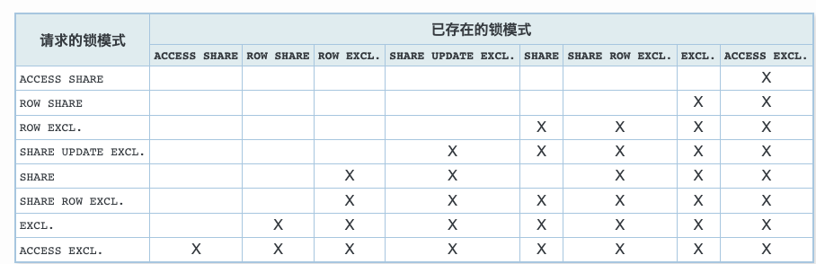
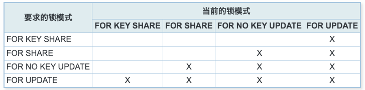

* content
{:toc}

> PostgresSQL相关使用笔记记录。

<!--more-->

# PostgresSQL

## 安装
> PostgreSQL可以由任何非特权用户安装， 并不需要超级用户 （root）的权限。


## SQL语言

* 创建一个schema

```postgresql
create schema test;
```
* 创建一个表

```postgresql
create table test.user(
    username varchar(32),
    age      int
);
```

* 删除表

```postgresql
drop table schemaname.tablename;
```

* 插入数据

```postgresql
insert into test.user(username, age) values ('DJuR', 30);
```
使用COPY从文本文件中装载大量数据

```postgresql
COPY test.user FROM '/home/user/user.txt';
```

* 查询语句

```postgresql
select * from test.user;
```

* 更新

```postgresql
update test.user set age = 31 where username = 'DJuR';
```

* 删除

```postgresql
delete from test.user where username = 'DJuR';
```

## 高级特性

* 视图

```postgresql
create view test.myuser as select username, age from test.user where username = 'DJuR';

select * from test.myuser;
```

* 外键

> `user.username` 必须是唯一约束

```postgresql
create unique index user_username_uindex on test."user" (username);
create table test.userinfo(
    username varchar(32) references test.user(username),
    city varchar(80)
);
```

* 事务

```postgresql
begin; -- 开启事务
-- sql
commit; -- 事务提交
rollback ; --事务回滚
```

* 窗口函数

```postgresql
select username, avg(age) over(partition by age) from test.user;
```

* 继承

```postgresql
create table test.admin(sex varchar(8)) inherits(test.user);

insert into test.admin(username, age, sex) values ('王二', 32, '男');
```

## 分区表

> 一个表何种情况下会从划分获益取决于应用，一个经验法则是当**表的尺寸超过了数据库服务器物理内存时**，划分会为表带来好处。
>
> 无法把一个常规表转换成分区表，反之亦然。不过，可以把一个包含数据的常规表或者分区表作为分区加入到另一个分区表，或者从分区表中移走一个分区并且把它变成一个独立的表。
>
> 分区表可以存在子分区表。

* 范围划分
> 表被根据一个关键列或一组列划分为“范围”，不同的分区的范围之间没有重叠。例如，我们可以根据日期范围划分，或者根据特定业务对象的标识符划分。

* 列表划分
> 通过显式地列出每一个分区中出现的键值来划分表。


* 哈希分区
> 通过为每个分区指定模数和余数来对表进行分区。每个分区所持有的行都满足：分区键的值除以为其指定的模数将产生为其指定的余数。


## 并发控制
> 数据一致性通过使用一种多版本模型（多版本并发控制，MVCC）来维护。这就意味着每个 SQL 语句看到的都只是一小段时间之前的数据快照（一个数据库版本），而不管底层数据的当前状态。这样可以保护语句不会看到可能由其他在相同数据行上执行更新的并发事务造成的不一致数据，为每一个数据库会话提供事务隔离。MVCC避免了传统的数据库系统的锁定方法，将锁争夺最小化来允许多用户环境中的合理性能。
> 
> 使用MVCC并发控制模型而不是锁定的主要优点是在MVCC中，对查询（读）数据的锁请求与写数据的锁请求不冲突，所以读不会阻塞写，而写也从不阻塞读。甚至在通过使用革新的可序列化快照隔离（SSI）级别提供最严格的事务隔离级别时，PostgreSQL也维持这个保证。
> 
> 在PostgreSQL里也有表和行级别的锁功能，用于那些通常不需要完整事务隔离并且想要显式管理特定冲突点的应用。不过，恰当地使用MVCC通常会提供比锁更好的性能。另外，由应用定义的咨询锁提供了一个获得不依赖于单一事务的锁的机制。

### 事务隔离级别

在各个级别上被禁止出现的现象是：

* 脏读
> 一个事务读取了另一个并行未提交事务写入的数据。

* 不可重复读

> 一个事务重新读取之前读取过的数据，发现该数据已经被另一个事务（在初始读之后提交）修改。

* 幻读

> 一个事务重新执行一个返回符合一个搜索条件的行集合的查询， 发现满足条件的行集合因为另一个最近提交的事务而发生了改变。

* 序列化异常

> 成功提交一组事务的结果与这些事务所有可能的串行执行结果都不一致。

**事务隔离级别表**


| 隔离级别 | 脏读	| 不可重复读 | 幻读| 序列化异常|
| :-----  | :---- | :---- | :---- |
| 读未提交 |	允许，但不在 PG 中 | 可能 |可能 | 可能|
| 读已提交 | 不可能 |	可能   |	可能	 | 可能 |
| 可重复读 | 不可能 |	不可能 |	允许，但不在 PG 中 |	可能 |
| 可序列化 | 不可能 |	不可能 |不可能 |	不可能 |

PostgreSQL 的读未提交模式的行为和读已提交相同。

### 显式锁

* 表级锁

  冲突的锁模式
  


* 行级锁
  
  冲突的行级模式
  

* 页级锁 

* 死锁

* 咨询锁

## 特殊查询处理方法

## 重复数据中只取一条数据

> 表结构及数据如下，按照`name`去重，取`len`小的数据，即id为2,4,5的数据。

表结构及数据：

```
id | name | len
----+------+-----
  2 | a    |   2
  1 | a    |   3
  4 | b    |  10
  5 | c    |   2
```

初步查询如下：

> 增加了row_number列，作为排序列

```sql
select name,id,len, row_number() over (partition by name order by len asc ) from test.test
```

 * `partition by`

   做分组(不聚合)，此处按照`name`字段分组。

 * `order by`

   做排序，此处按照`len`排序。

初步查询结果:

```sql
 name | id | len | row_number
------+----+-----+------------
 a    |  2 |   2 |          1
 a    |  1 |   3 |          2
 b    |  4 |  10 |          1
 c    |  5 |   2 |          1
```

最终查询：

```sql
select * from (select name,id,len, row_number() over (partition by name order by len asc ) as row_number from test.test) a where row_number = 1;
```

最终结果：

```
 name | id | len | row_number
------+----+-----+------------
 a    |  2 |   2 |          1
 b    |  4 |  10 |          1
 c    |  5 |   2 |          1
```

**说明：**

partition只做分组，不做聚合

```sql
select id, name,len,count(1) over(partition by name order by name) as count from test.test;
```

结果:

```
id | name | len | count
----+------+-----+-------
  2 | a    |   2 |     2
  1 | a    |   3 |     2
  4 | b    |  10 |     1
  5 | c    |   2 |     1
```


# psql的使用

* 基本命令参数

```shell
psql --help
  -h, --host=HOSTNAME      database server host or socket directory (default: "local socket")
  -p, --port=PORT          database server port (default: "5432")
  -U, --username=USERNAME  database user name (default: "djuru")
  -w, --no-password        never prompt for password
  -W, --password           force password prompt (should happen automatically)
```


* 在`linux`安装环境，进入`postgres`用户，可已`postgres`用户模式登录

```shell
psql [-d 数据库]
```

* mac环境或者连接远程服务

```shell
psql -h host地址 -p 端口  -U 账户 -d 数据库 
```

* 交互模式导出导入数据

```postgresql
-- 列出所有数据库
\l

-- 切换数据库
\c 数据库名

-- 从数据库copy到文件
\copy (sql语句) to '存储文件' with csv | binary;

-- 从文件copy到数据库
\copy 表(字段1，字段2，...) from '存储文件' with csv | binary;

-- 将查询导出到csv文件 数据量大会执行时间很长 700万数据，执行3分钟左右
\copy (查询语句) to '文件路径' with csv;

-- 将csv数据导入到数据库
\copy schema.table(filed1,...) from '文件路径' with csv;
```

* psql远程执行sql

```shell
psql -h host -p port -d database -U username -c "\copy (select id,name from schema.user) to '/tmp/user.csv' with csv;"
```

# pg_dump 的使用

> pg_dump可以执行数据库、schema、表的备份，导出等操作
> 

## 导出数据

```shell
pg_dump -h 地址 -p 端口号 -U 账号 -d 数据库 -n schema名 -Fc 导出格式 > 文件
```

* -F
  * P plain
    输出一个纯文本形式的SQL脚本文件（默认值）。
  * c custom
    输出一个适合于作为pg_restore输入的自定义格式归档。
  * d directory
    输出一个适合作为pg_restore输入的目录格式归档。
  * t tar
    输出一个适合于输入到pg_restore中的tar-格式归档。
* -j 
  执行并发导出，只能和`-Fd`一起操作。

  

# 后记 （项目升级数据同步）

> 项目升级，数据库表结构发生变化，单表数据又过大，数据导出速度慢等问题。

### 问题处理
1. 数据量大，sql查询慢，存在group by操作，通过`explain`查看执行计划进行分析
2. 查询条件和groupBy语句添加索引，或者构建中间临时表。
3. 通过`pd_dum`和`pg_restore`工具配合处理

# 参考资料

[1] [postgres官方文档](http://www.postgres.cn/docs/13/reference-client.html)


