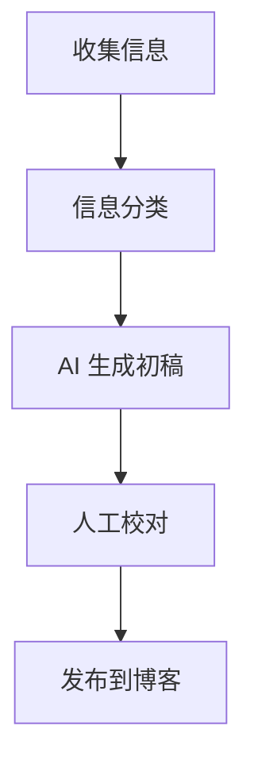

## 本周一句话
> 系统思维 + AI 工具 = 高效解决问题的新方式。

## 系统思维实践
- **分解问题**：将复杂任务拆解为模块，每个模块可独立验证。
- **闭环反馈**：对每个模块输出结果进行校验和优化。
- **迭代优化**：持续改进流程和工具组合。

> 延伸阅读：[系统思维入门](https://en.wikipedia.org/wiki/Systems_thinking)

### 示例：任务拆解流程
```text
目标：生成 AI 周刊文章
1️⃣ 收集素材：新闻、技术博客、AI 实践案例
2️⃣ 结构化信息：按技术、AI、工具、思考分类
3️⃣ 自动生成初稿：利用 LLM
4️⃣ 校对 & 修正：人工审阅 + 自动优化
5️⃣ 发布：Markdown → Astro 博客
````

## AI 工具流

* **LLM 协同**
  使用多个模型协同完成任务：

  * 文本生成：ChatGPT / Claude
  * 知识索引：LangChain / LlamaIndex
  * 自动化脚本：Python + OpenAI API

* **Prompt 设计技巧**

  * 指令明确、分步输出
  * 提供上下文
  * 例子 + 模板化

> 参考：[Prompt Engineering Guide](https://learnprompting.org/)

### 工作流示意



## 本周工具推荐

1. **Obsidian**：个人知识管理工具，可与 AI 插件结合。
   [官网](https://obsidian.md/)
2. **LangChain**：构建 LLM Agent 和多模型工作流。
   [GitHub](https://github.com/hwchase17/langchain)
3. **Astro + Tailwind**：静态博客模板，支持 Markdown 自动渲染。
   [Astro 官方文档](https://docs.astro.build/)

## 思考与感悟

* 系统思维让 AI 工具不再零散，而是形成可复用的流程。
* Prompt 设计和流程迭代是高效 AI 协作的核心。
* AI 工具不是替代，而是增强我们的思考力。

> 下周预告：周刊 #002 将聚焦 **多模型协同与自动化 Agent 实践**。

```


这个结构可以直接复用：

- **Frontmatter**：控制标题、摘要、标签和日期  
- **Markdown 标题**：划分模块  
- **引用块**：强调观点  
- **代码块**：流程 / 示例  
- **Mermaid 图表**：展示工作流  
- **超链接**：方便参考资料  
```